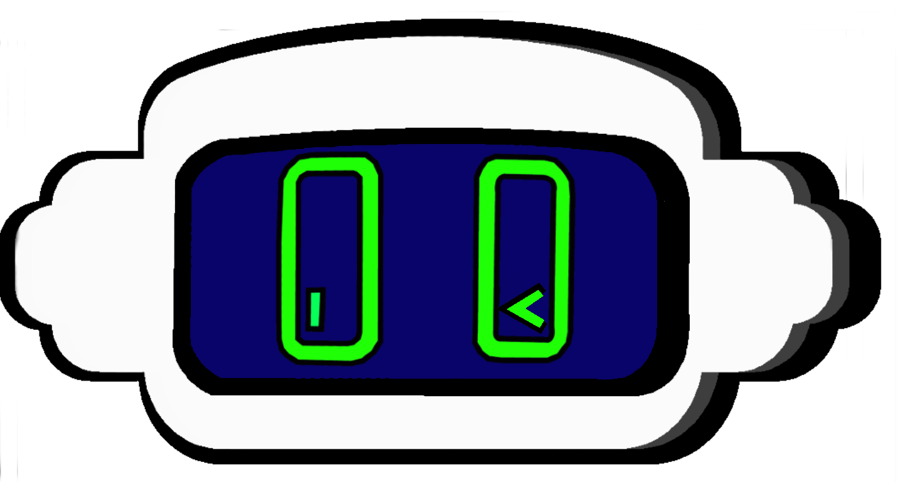

<h2 align="center">Hello world 👋, Here Astroobot! 🤖</h2>

<h3 align="center">Landing from <b>Bogota, Colombia</b> </h3>
<h3 align="center">☄️🌠After eons drifting through the Milky Way, Astroobot has finally landed on Earth. Speaking the only language he has in common with humans ☄️🌠:  <strong>CODE!</strong></h3>

<h3 align="center">Coding with : </h3>

  

	

<!-- Table sample to put future projects 
<table>
  <thead align="center">
    <tr border: none;>
      <td><b>🎁 Projects</b></td>
      <td><b>⭐ Stars</b></td>
      <td><b>📚 Forks</b></td>
      <td><b>🛎 Issues</b></td>
      <td><b>📬 Pull requests</b></td>
    </tr>
  </thead>
  <tbody>
    <tr>
      <td><a href="https://github.com/thmsgbrt/react-simple-pull-to-refresh"><b>React PullToRefresh component</b></a></td>
      <td></td>
      <td></td>
      <td></td>
      <td></td>
    </tr>
	  <tr>
      <td><a href="https://github.com/thmsgbrt/Chrome-Extension-with-React-and-Typescript-Starter-Pack"><b>Typescript & React Chrome Extension Starter</b></a></td>
      <td></td>
      <td></td>
      <td></td>
      <td></td>
    </tr>
    <tr>
      <td><a href="https://github.com/thmsgbrt/nodejs-typescript-express-apollo-graphql-starter"><b>NodeJs Express TypeScript GraphQL Starter</b></a></td>
      <td></td>
      <td></td>
      <td></td>
      <td></td>
    </tr>
  </tbody>
</table> --!>
